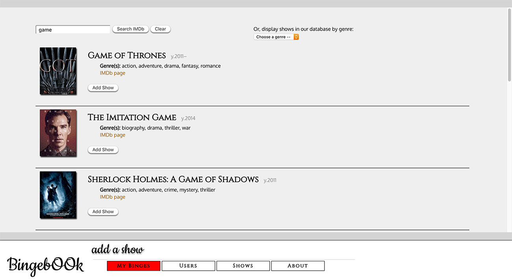

# Bingebook (front end) (full-stack app)

*Bingebook is a full-stack binge-facilitating social networking app.*

## *This repo was Bingebook's project front half before both ends were combined. This repo is now ARCHIVED. Find the [current repo here](https://github.com/joseph-p-pasaoa/bingebook__FSWeb).*

### **Developer: JOSEPH P. PASAOA**

## Technologies Implemented
+ PostgreSQL 12.1
+ Express.js 4.16.1
+ React 16.12.0
+ React/Redux 7.1.3
+ Redux 4.0.5
+ React Router Web 5.1.2
+ Pg-promise 10.3.2
+ Axios 0.19.2
+ Node.js 13.8.0
+ JavaScript 2019 / ECMAScript 10
+ HTML5
+ CSS3
+ Git / Github

## Instructional Team
+ **LEAD Instructor:** [Alejandro Franco -- ( @alejo4373 )](https://github.com/alejo4373)
+ **IA:** [Jung Rae Jang -- ( @jungraejang )](https://github.com/jungraejang)
+ **IA:** [Wynter Reid -- ( @wynterreid )](https://github.com/wynterreid)
+ **Program Manager:** [Dessa Shepherd](https://www.linkedin.com/in/dessa-shepherd-7a55b374/)

---
## *This repo is now ARCHIVED. Find the [current repo here](https://github.com/joseph-p-pasaoa/bingebook__FSWeb).*
